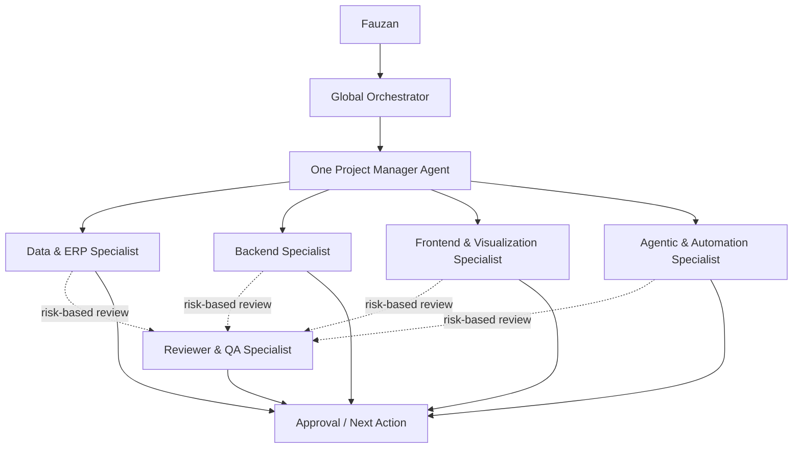

# Frozen Agent Architecture

**Status:** Concept frozen for future implementation  
**Date:** 2026-08-06  
**Scope:** Cross-project agent orchestration model

## Decision

The intended mature architecture uses two separate dimensions:

1. **Project Manager Agents** own project-specific context.
2. **Shared Specialist Agents** execute capability-specific work across projects.

Project managers are generalist coordinators. They should not be expected to perform every specialist task themselves.



## Architecture Layers

### 1. Fauzan

Defines the real goal, constraints, business judgment, and approval.

### 2. Global Orchestrator

- Clarifies the request.
- Freezes scope.
- Selects the relevant project.
- Routes work to the project manager.
- Decides whether review is required.

Initially, Fauzan and ChatGPT may perform this orchestration manually.

### 3. Project Manager Agents

One project manager may exist for each **active project that benefits from persistent context**.

Examples:

- Dashboard Odoo Project Manager
- Portfolio Project Manager
- Telegram Controller Project Manager
- PersonalOS / Agent Flow Project Manager
- Run Monitor or Trading Project Manager

A project manager owns:

- project purpose and users;
- roadmap and current state;
- repository structure;
- previous decisions;
- project terminology and constraints;
- task breakdown and specialist routing;
- preservation of results and next actions.

A project manager coordinates work but normally should not act as every specialist.

### 4. Shared Specialist Agents

#### Data & ERP Specialist

Owns Odoo, SQL, reporting, business-process logic, procurement, inventory, profitability, data modelling, and validation.

#### Backend Specialist

Owns Python, APIs, services, persistence, state handling, application logic, runtime errors, and backend implementation.

#### Frontend & Visualization Specialist

Owns page structure, components, dashboards, responsive behaviour, process visuals, interaction, animation, and browser-level validation.

#### Agentic & Automation Specialist

Owns agent workflows, controllers, Codex/OpenCode integration, notifications, orchestration, permissions, task state, monitoring, and recovery behaviour.

#### Reviewer & QA Specialist

Owns independent review, requirement compliance, regressions, tests, assumptions, security or permission concerns, and readiness assessment.

The reviewer is conditional. It should not be activated for every small change.

## Normal Task Flow

```text
Fauzan
  -> Global Orchestrator
  -> One Project Manager
  -> One Primary Specialist
  -> Optional Reviewer
  -> Approval / Next Action
```

Not every project uses every specialist. Most tasks should use only one primary implementing specialist.

## Frozen Rules

1. **Projects own context; specialists own capability.**
2. Do not create one specialist for every repository.
3. Use persistent project managers only for active projects that justify them.
4. Delegate bounded tasks, not uncontrolled agent chains.
5. Only one primary specialist should edit overlapping areas at a time.
6. Review is conditional and based on risk.
7. Keep simple tasks simple.
8. Specialist instructions and model selection are separate decisions.
9. Start with manual routing and automate only after repeated workflows are proven.
10. This document freezes the concept, not the implementation details.

## Standard Delegation Packet

Each project manager should brief a specialist with:

```text
Project:
Current state:
Exact objective:
Relevant files or components:
Confirmed business rules:
Constraints:
Do not change:
Expected visible result:
Validation required:
```

## Intended Mature Structure

- **1 Global Orchestrator**
- **Project Manager Agents for active projects**
- **5 shared specialist roles**
- **One primary specialist per normal task**
- **Reviewer activated only when risk justifies it**

Implementation should begin manually, mature gradually, and automate routing only after the handoff rules are reliable.
