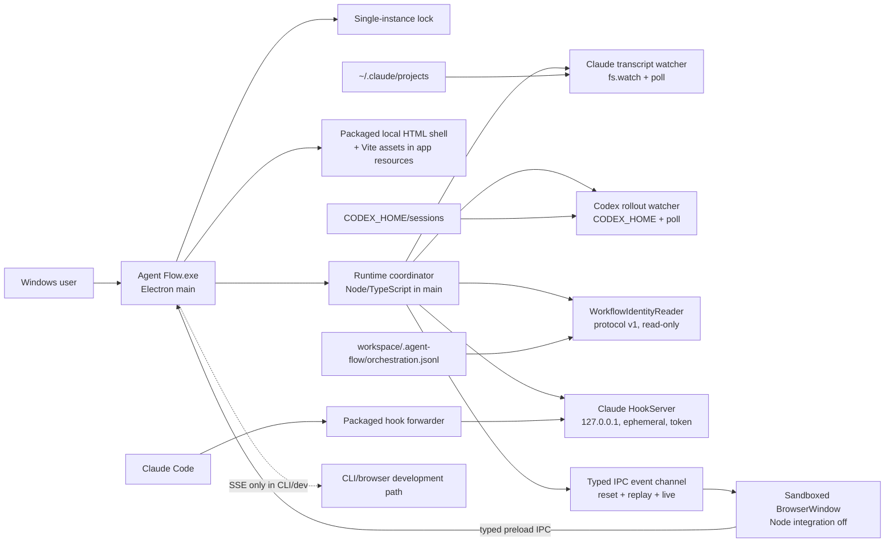
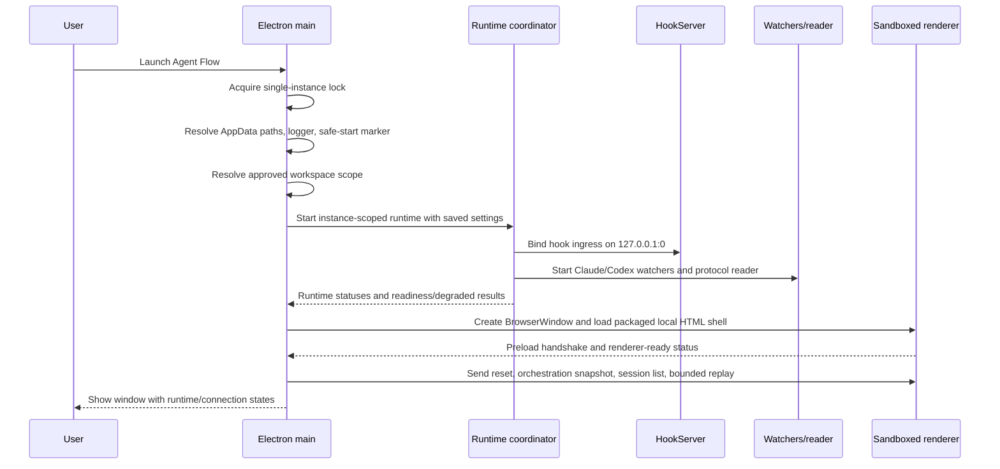

# Stage 9 packaged desktop application architecture

Status: Stage 9.1 architecture freeze proposal
Baseline: `main` at `76ca23b0ade291955a75cfee0b411c7120bc86c8`
Scope: architecture and release contract only; no desktop implementation is included in this stage.

## 1. Problem statement

Agent Flow already has the useful runtime pieces: a standalone Node application, a bundled Vite visualizer, a local relay, Claude hooks, Claude transcript watching, Codex rollout watching, protocol v1 orchestration normalization, replay, and the approved multi-agent canvas. The current standalone path still exposes those pieces as developer operations:

1. install Node and pnpm;
2. run a command from a workspace;
3. start one or more local servers;
4. open a browser on a localhost URL;
5. understand a port, a relay, and a hook discovery file.

That is an acceptable development and CLI workflow, but it is not a Windows desktop application. A packaged application must own its window and its internal runtime, explain partial failure, survive restarts, and keep mutable state out of the installation directory without changing the existing event authority or canvas semantics.

## 2. Desired user experience

### Product contract

The initial Windows application is one per-user installed Agent Flow window. Opening it starts the owned runtime automatically and loads the existing live canvas. The user does not run PowerShell, pnpm, a relay, or a browser command for normal use.

The application distinguishes these states instead of collapsing them into one `disconnected` label:

| State | Meaning shown to the user |
| --- | --- |
| Starting | Agent Flow is starting its own runtime and checking local runtime locations. |
| Watching | At least one selected runtime is available and its local event source is active. |
| Partial | One runtime is available; another failed or is unavailable. The available runtime continues. |
| Ready, no sessions | The application is healthy, but no recent matching session exists. |
| Runtime unavailable | The runtime or its session directory cannot be found or read. |
| Degraded | The UI is healthy, but a hook, watcher, relay, or optional diagnostic component failed. |
| Disconnected | The application cannot currently receive local events; retry and diagnostics remain available. |

Each runtime status card reports these independent facts: executable detected (when a command lookup is available), session source directory detected, source readable, hook healthy (Claude only), and active sessions present. A directory with old JSONL files is not presented as proof that its CLI is installed, and an installed CLI with no sessions is not presented as a runtime failure.

### First run

The first-run window opens with a short splash containing `Starting Agent Flow` and two runtime status cards. It never requires a terminal.

| Local condition | First-run result |
| --- | --- |
| Codex session source detected | Shows `Codex session source available`; starts the passive rollout watcher and reports the effective `CODEX_HOME`. Executable discovery, source discovery, source readability, and active sessions are separate facts. |
| Claude session source detected | Shows `Claude session source available`; starts transcript watching and offers or performs hook setup without overwriting unrelated hooks. Executable discovery, source discovery, hook health, and active sessions are separate facts. |
| Both detected | Shows both cards as available and starts both in `auto` mode. |
| Neither detected | Opens the canvas in a healthy empty state: `No supported agent sessions found`. It explains the searched locations and offers `Retry` and `Open diagnostics`; it does not treat this as an application failure. |
| A session directory exists but is unreadable | Keeps the window open, marks that runtime `Permission needed`, states which directory needs access, and provides `Retry`/`Open folder` where safe. |
| Existing `.agent-flow` orchestration data or legacy `~/.agent-flow` state exists | Reuses it without rewriting authoritative orchestration data. Any migration is additive and reported as `Existing Agent Flow data reused`. |
| Internal server, hook, or watcher startup fails | Opens the UI in `Degraded` mode. The message says what failed, what still works, the next action, and the local diagnostics location. |

If no approved workspace is saved, first run asks the user to choose a workspace with the native Windows folder picker. The user may explicitly choose `All recent sessions`, which carries a privacy warning and uses bounded per-workspace discovery. A saved workspace is used on later launches. This avoids silently exposing unrelated private workspaces while still supporting a deliberate global view. The existing CLI keeps its current `process.cwd()`-scoped behavior for compatibility.

### Normal run

1. A short splash is shown until the renderer IPC handshake and runtime status are ready.
2. The existing Stage 8 visualizer loads without a canvas redesign.
3. Connection and runtime status are visible in the application chrome.
4. The workflow overview, ungrouped sessions, selected-agent details, and authoritative relationships remain available.
5. Fullscreen remains the existing application-level full-viewport canvas mode. It does not depend on browser fullscreen permission.
6. Settings and diagnostics are reachable from the application menu or a visible control; technical IDs remain secondary detail, not primary labels.
7. Closing the window exits the application completely for the initial release. There is no tray process and no close prompt by default. External Claude/Codex processes are never stopped.

### Error language

Every user-facing failure has four parts:

- what failed;
- what still works;
- what the user can do next;
- where diagnostics are stored.

Raw stack traces, full transcript lines, prompts, environment dumps, and internal port numbers are diagnostic detail only. They are not the primary error message.

## 3. Current architecture map

### Repository surfaces

Agent Flow is a pnpm workspace with three runtime surfaces:

| Surface | Current role | Evidence |
| --- | --- | --- |
| `extension/` | VS Code extension host, native runtime watchers, webview host, extension packaging | `extension/src/extension.ts`, `extension/src/claude-runtime.ts`, `extension/src/codex-runtime.ts`, `extension/esbuild.js`, `extension/package.json` |
| `web/` | Shared React visualizer; Next.js browser/dev shell and Vite library builds | `web/app/page.tsx`, `web/app-entry.tsx`, `web/webview-entry.tsx`, `web/vite.config.shared.ts` |
| `app/` | Standalone CLI application that serves the built visualizer and relay over local HTTP | `app/src/app.ts`, `app/src/server.ts`, `app/src/static.ts`, `app/build.js` |
| `scripts/` | Relay, setup, replay, telemetry, and development process orchestration | `scripts/relay.ts`, `scripts/dev.js`, `scripts/dev-relay.ts`, `scripts/setup.js`, `scripts/telemetry.ts` |

### Current process flow

#### Standalone application

`npx agent-flow-app` executes `app/dist/app.js`, which is produced by `app/build.js`:

1. `app/src/app.ts` parses CLI arguments and calls `ensureSetup()`.
2. `scripts/setup.js` installs/configures the Claude command hook under the user profile when needed. It currently resolves a system `node` with `where`/`command`.
3. `app/src/server.ts` creates telemetry, calls `createRelay({ workspace: process.cwd() })`, and creates one HTTP server.
4. That server serves `app/dist/webview/` and exposes `/events` for SSE.
5. The server listens on `127.0.0.1`; the current default is `DEFAULT_RELAY_PORT` (`3001`).
6. The app opens the default browser unless `--no-open` is supplied.
7. SIGINT, SIGTERM, and SIGHUP call cleanup; cleanup closes the HTTP server, disposes the relay, flushes telemetry, and calls `process.exit(0)`.

There is no child Node process in the standalone app itself. The relay and its watchers execute in the same Node process as the HTTP server.

#### Development application

`pnpm run dev` runs `scripts/dev.js`, which uses `concurrently` to start:

- `scripts/dev-relay.ts`, bundled by `scripts/build-relay.js`, on fixed loopback port `3001`;
- the Next.js development server through `pnpm run dev:web`, normally on loopback port `3000`.

The script sets `NEXT_PUBLIC_DEMO=0` and `NEXT_PUBLIC_RELAY_PORT=3001`. Development CORS allows only localhost origins. `pnpm run dev:demo` starts the web process without the relay and uses mock data.

#### VS Code extension

The extension host starts Claude and Codex runtimes in `extension/src/extension.ts`. The production webview uses Vite assets from `extension/dist/webview/` and VS Code `postMessage`. Explicit development mode embeds a Next.js page in a localhost iframe and forwards messages through a bridge.

The extension does not use the standalone relay as its primary transport:

- Claude uses `HookServer` plus `SessionWatcher`.
- Codex uses `CodexSessionWatcher`.
- The host sends typed messages to the webview through `VisualizerPanel`.

### Watchers, normalization, and authority

#### Claude

The Claude path has two local sources:

- the command hook sends JSON over HTTP to `HookServer` on `127.0.0.1`;
- `SessionWatcher` or the standalone relay watcher tails `~/.claude/projects/<encoded-project>/<session>.jsonl` and subagent files with `fs.watch` plus polling fallback.

The extension runtime explicitly routes lifecycle ownership between hook and transcript sources to avoid duplicate lifecycle nodes. The standalone relay contains its own shared watcher wiring in `scripts/relay.ts`; future desktop work must preserve one authoritative event ownership rule and must not introduce a third parser.

The current discovery JSON contains only port, PID, and workspace. Packaged discovery is a versioned extension of that record: Agent Flow-owned records add a random capability and an ownership marker; old records remain readable for CLI/extension compatibility but are not sufficient for authenticated desktop hook ingress.

#### Codex

`CodexSessionWatcher` reads the filesystem, not a Codex hook or network API. It resolves `CODEX_HOME` or defaults to `~/.codex`, scans recent `sessions/YYYY/MM/DD` directories, filters by `session_meta.cwd` when scoped, handles Windows path casing, watches files and directories, and polls as a fallback. `CodexRolloutParser` produces `AgentEvent` values and `NativeCodexBridge` produces authoritative protocol v1 orchestration events from explicit native metadata.

The watcher can run with no workspace filter; this is the basis for the packaged desktop's proposed all-recent-session mode.

#### Orchestration

`WorkflowIdentityReader` reads the producer-owned append-only `.agent-flow/orchestration.jsonl` file, or an absolute/workspace-relative `AGENT_FLOW_ORCHESTRATION_LOG` override. Agent Flow is read-only. It validates, bounds, deduplicates, expires, and conflict-invalidates records. It does not infer relationships from timing, paths, prompts, or event order.

The desktop package must keep this authority boundary and protocol version 1 unchanged. Native Codex normalization remains supplemental to the manual local protocol, with conflicts left invalid/ungrouped.

### Desktop Claude event ownership contract

The desktop runtime must use one routing table, derived from `extension/src/claude-runtime.ts`, and test it across hook and transcript fixtures. The table is a release contract, not an invitation to add another parser:

| Event family | Owner when the transcript watcher has the session | Fallback when no transcript session is attached |
| --- | --- | --- |
| Session start, orchestrator spawn, transcript-derived messages/tool calls/results, subagent lifecycle, context/model replay | Claude transcript watcher/parser | Hook server may provide the hook event only when no watcher owns that session |
| Hook-only notifications and permission requests | Hook server | Hook server |
| Orchestrator stop/completion | Transcript watcher/session lifecycle; hook completion is filtered to idle unless it explicitly marks session end | Hook server |
| Malformed/duplicate source records | Drop or log a bounded diagnostic | Drop or log a bounded diagnostic |

Cross-source tests must prove that a single session does not receive duplicate spawn/complete/subagent lifecycle nodes. The existing standalone relay’s manual watcher wiring and the extension’s `SessionWatcher` must converge on this behavior before desktop release.

### Build and UI pipeline

There are two browser technologies in the repository, with different roles:

| Build path | Current output | Use in packaged desktop |
| --- | --- | --- |
| Next.js (`web/app/*`, `web/package.json`) | Browser/dev application; `pnpm run build:web` | Keep for browser development and standalone web workflows; not the desktop production asset source. |
| Vite (`web/vite.config.app.ts`) | `app/dist/webview/index.js` and `index.css` through `app/build.js` | Use this existing standalone bundle for the Electron renderer. |
| Vite (`web/vite.config.webview.ts`) | `extension/dist/webview/index.js` and `index.css` | Keep for the VS Code extension. |
| esbuild (`app/build.js`) | `app/dist/app.js` | Keep the CLI bundle; extract lifecycle-neutral pieces for desktop instead of making the desktop depend on a terminal launch. |

The current standalone UI is therefore the Vite `app-entry.tsx` build, not Next.js static output. `web/hooks/use-vscode-bridge.ts` connects the standalone bundle to a relative `/events` endpoint when `NEXT_PUBLIC_RELAY_PORT` is empty.

### Communication map

| From | To | Current transport | Packaged decision |
| --- | --- | --- | --- |
| Claude hook command | Hook server | HTTP POST to `127.0.0.1:<dynamic-port>` | Retain as an authenticated loopback ingress because Claude is external to Agent Flow. |
| Claude/Codex session files | Watchers | `fs.watch`, polling, direct reads | Retain in Electron main. |
| Orchestration file | `WorkflowIdentityReader` | Direct filesystem read/poll | Retain; read-only and local. |
| Standalone relay | Browser UI | SSE over localhost HTTP | Retain for CLI and browser development only. |
| Extension host | VS Code webview | `postMessage` | Preserve unchanged. |
| Packaged renderer | Electron main | Typed preload IPC | Use the same event/replay message schema over a narrow allowlisted channel; no raw Node access. |
| Runtime/relay | Renderer | Direct in-process callbacks → typed IPC | Preserve `AgentEvent`, session lifecycle, orchestration snapshot/batch, and replay semantics without a renderer TCP hop. |

### Existing local state

- Workspace orchestration is `.agent-flow/orchestration.jsonl`, ignored by Git and owned by its producer.
- `AGENT_FLOW_ORCHESTRATION_LOG` can override that path.
- Codex session data is under `CODEX_HOME` or `~/.codex/sessions`.
- Claude data and settings are under `~/.claude/projects`, `~/.claude/settings.json`, and `~/.claude/agent-flow`.
- Published standalone telemetry currently uses `~/.agent-flow/telemetry/events.jsonl`, `.cursor`, and `~/.agent-flow/installation-id`; development and the extension are silent.
- The UI currently persists only small browser preferences such as the sound setting through `localStorage`; there is no existing desktop settings store.

### Tests and current gaps

The root tests cover relay replay, orchestration parsing/replay/bounds, session summaries, workflow control-room behavior, telemetry, and parser behavior. Extension tests cover Codex parsing/native bridge and filesystem utilities. The required typechecks and production builds cover the current web and extension surfaces.

There is no desktop lifecycle test, no app startup readiness test, no installer test, no single-instance test, no orphan-process test, and no clean-machine Windows package test. These are Stage 9 deliverables, not reasons to change Stage 8 now.

## 4. Constraints and assumptions

### Hard constraints

1. Stage 8 is the visual and protocol baseline. The existing live canvas, fullscreen mode, selected-agent details, ungrouped sessions, authoritative relationships, native Codex integration, Claude support, manual protocol fallback, development mode, CLI, and extension behavior remain usable.
2. Protocol v1 and orchestration authority do not change in Stage 9.
3. The desktop implementation is deferred to later stages. This document adds no package, dependency, installer, shell, or UI change.
4. Mutable runtime data never lives in the installed application directory.
5. Production network listeners bind only to `127.0.0.1`, never `0.0.0.0` or a LAN address.
6. The packaged application does not own or terminate Claude Code, Codex, VS Code, or user workspaces.

### Evidence-based assumptions

- Electron is permitted to bundle the existing TypeScript/Node runtime in its main process; no Rust rewrite is required.
- Windows 10 and Windows 11 are the initial target. Electron bundles its Chromium runtime, so WebView2 installation is not a release prerequisite for the selected architecture.
- Code-signing credentials are not present in this repository and must not be assumed. Unsigned development builds are allowed only as clearly labelled development artifacts.
- The current Node-based Claude hook command is a release risk because the standalone setup resolves `node` from PATH. The desktop package must ship a self-contained hook forwarder or an equivalent packaged execution path before claiming normal-use installation requires no Node management.
- “Detected” means a runtime executable and/or expected session source is discoverable and readable. It does not mean that the runtime currently has an active session.

## 5. Packaging-option comparison matrix

Scores are architectural fit, not measured benchmarks: 1 is poor, 3 is workable with material cost, and 5 is strong. Package size and memory scores are relative; lower resource use receives the higher score. C means the existing Node application is placed behind a desktop wrapper without moving ownership into a real desktop main process.

| Criterion | A: Electron main + embedded renderer | B: Tauri 2 + Rust shell/sidecar | C: Existing Node app + wrapper |
| --- | ---: | ---: | ---: |
| Reuse current TypeScript/Node code | 5 | 2 | 5 |
| Reuse Stage 8 without visual regression | 5 | 5 | 5 |
| Windows 10/11 support | 5 | 4 | 4 |
| Installation simplicity | 4 | 4 | 2 |
| Startup time | 4 | 4 | 3 |
| Package size | 2 | 5 | 4 |
| Memory use | 2 | 4 | 3 |
| Process lifecycle control | 5 | 4 | 1 |
| Clean shutdown | 5 | 4 | 1 |
| Crash recovery | 4 | 4 | 1 |
| Single-instance enforcement | 5 | 4 | 1 |
| Codex discovery | 5 | 3 | 5 |
| Claude discovery and hook ingress | 5 | 3 | 5 |
| Filesystem watcher support | 5 | 3 | 5 |
| WebView compatibility | 5 | 4 | 4 |
| Localhost and port control | 4 | 4 | 3 |
| Offline operation | 5 | 4 | 5 |
| Security isolation | 4 | 5 | 2 |
| Content Security Policy | 5 | 5 | 2 |
| Safe renderer-to-main communication | 4 | 5 | 1 |
| Secret/private-session protection | 4 | 4 | 2 |
| Code-signing integration | 4 | 4 | 2 |
| Windows SmartScreen path | 3 | 3 | 2 |
| Installer creation | 5 | 4 | 2 |
| Update strategy | 5 | 4 | 1 |
| Logs and diagnostics | 5 | 4 | 1 |
| Maintainability for an AI-assisted TypeScript developer | 5 | 2 | 4 |
| Cross-platform potential | 5 | 5 | 4 |
| Testability | 5 | 3 | 2 |
| Upstream compatibility | 5 | 4 | 5 |
| Migration complexity | 4 | 2 | 5 |

### Matrix interpretation

- Electron has the best fit because the existing app already bundles Node-compatible TypeScript, the existing Vite renderer, HTTP/SSE, `fs.watch`, and the VS Code-free relay path. It can own the window and the runtime without a Node child process.
- Tauri has an attractive resource and isolation profile, but the current watcher/relay/hook code would either become a Rust rewrite or a managed Node sidecar. That sidecar is the difficult part of this repository, not the canvas.
- A wrapper around `agent-flow-app` reuses files but does not solve ownership. If it starts an external Node process and opens a browser or webview around it, installation, single-instance behavior, crash recovery, orphan cleanup, and port security remain hidden CLI problems.

The matrix does not claim Electron is smaller or intrinsically safer. It selects the smallest migration that can satisfy the user experience and still lets the existing runtime remain the source of truth.

## 6. Selected architecture

### Decision

Select **Electron** for the Windows desktop shell, with:

- an Electron main process that owns application lifecycle and the existing Node-compatible runtime;
- a sandboxed `BrowserWindow` that loads a packaged local HTML shell and the existing Vite standalone bundle;
- direct in-process calls between the main process and watcher/normalization modules;
- a typed preload IPC event channel for status, replay, live events, settings, diagnostics, and approved file-opening actions;
- a separate ephemeral `127.0.0.1` hook ingress for Claude command hooks;
- SSE retained for the CLI and browser development surfaces, not for the packaged renderer;
- no ordinary Node sidecar process in the first desktop architecture.

The packaged runtime is a host for the existing event system, not a new orchestration authority. The application must not infer a relationship, modify protocol v1, or create a second meaning for a session event.

### Why Electron fits this repository

1. The standalone app already proves that the TypeScript/Node runtime, relay, Vite output, and file watchers work outside VS Code.
2. The web UI already has a standalone `app-entry.tsx` and a relative SSE connection path.
3. The watcher code uses Node filesystem primitives and a small VS Code shim; it does not require a Rust implementation to read sessions.
4. Electron supplies a predictable bundled Chromium renderer on both Windows 10 and 11, which helps preserve the approved canvas.
5. Electron’s main process can hold the application lock, own cleanup, record crashes, and expose a narrow preload bridge without asking users to manage Node.
6. Direct IPC removes the renderer’s local TCP attack surface while the existing SSE replay contract remains available to the CLI and browser development path.

### Runtime ownership

The main process starts one instance-scoped runtime coordinator. The coordinator reuses the current relay and watcher modules, but the server lifecycle must be separated from CLI concerns such as `process.exit()` and automatic external browser opening. Runtime startup returns an explicit readiness result and a shutdown promise. The shared coordinator must not install a process-global crash handler or make `createRelay()` permanently single-use through module-global state.

The first production desktop implementation should run watchers, parsers, `WorkflowIdentityReader`, native Codex normalization, hook ingress, bounded replay state, and telemetry in the Electron main process. The renderer receives the same reset/snapshot/session-list/replay messages through typed IPC. A stateless, Node-independent hook-forwarder executable is installed for Claude and is launched by Claude, not owned by Electron. A persistent child process is allowed only if a later design explicitly gives Electron ownership, readiness, restart, and process-tree cleanup semantics.

### UI build decision

Use the existing Vite standalone target from `web/vite.config.app.ts` and `app/build.js`. It produces the same `app/dist/webview/index.js` and `index.css` that the current standalone app serves. Add only a packaged local HTML shell with relative asset paths; the shell is loaded from the installed application resources and is not served over a production TCP listener.

Do not use Next.js static output for the desktop renderer in Stage 9. Next.js remains the browser/development application. This avoids adding a second desktop asset path and preserves the visual output already approved in Stage 8.

## 7. Rejected options and reasons

### Tauri 2

Rejected for Stage 9 because the repository has no Rust shell or sidecar contract, while its difficult integrations are specifically Node-centric: Claude hook forwarding, Codex/Claude filesystem watching, JSONL parsing, native Codex normalization, and local SSE. A Tauri shell would either duplicate those in Rust or package/manage a Node sidecar and then solve the same lifecycle, code-signing, update, and orphan-process problems across two runtimes. Tauri remains a future option if package size or memory is a measured release blocker after Electron ships, not an equal first migration.

### Existing Node application plus desktop wrapper

Rejected as the product architecture because a wrapper that launches `agent-flow-app` externally still relies on a separate Node executable, the current CLI port contract, browser/server startup, and signal cleanup. It can be useful as a temporary development harness, but it does not provide a reliable single application owner. The existing CLI remains supported as a compatibility surface.

### Direct renderer-to-main IPC as the packaged event transport

Selected for the packaged renderer. It requires a small adapter in the shared bridge and a lifecycle-neutral event sink, but it removes an unnecessary renderer TCP surface and makes sender validation explicit. The existing SSE event/replay path remains unchanged for the standalone CLI and browser development surfaces.

## 8. Component diagram



The external Claude and Codex processes remain outside the ownership boundary. The only external-to-Agent-Flow ingress is the bounded Claude hook request and the read-only session files.

## 9. Startup sequence



### Readiness and timeout contract

- Lock acquisition happens before runtime or window creation.
- Runtime initialization and first scan have a ten-second budget; filesystem discovery may continue after the window becomes visible.
- Renderer load and handshake have a ten-second budget after the runtime coordinator is initialized.
- The total startup splash budget is twenty seconds. If exceeded, the window opens in `Degraded` mode with retry and diagnostics rather than hanging indefinitely.
- Claude and Codex start independently. One failure never prevents the other from running.
- A missing runtime directory is a normal unavailable state, not a startup exception.

The packaged app must expose a small health/status object to the renderer, including component state, effective runtime roots, last error class, and retryability. It must not expose raw private event content through startup status.

## 10. Shutdown sequence

```mermaid
sequenceDiagram
    participant U as User/Windows
    participant M as Electron main
    participant V as Renderer
    participant R as Runtime coordinator
    participant H as HookServer
    participant W as Watchers

    U->>M: Close window, quit, sign out, or shutdown
    M->>M: Mark closing; reject duplicate close handling
    M->>V: Optional final status update
    M->>H: Stop hook ingress and remove discovery record
    M->>W: Dispose watchers, timers, workflow reader, buffers
    M->>R: Flush telemetry and close owned resources
    M->>M: Wait up to five seconds, then finish best-effort cleanup
    M-->>U: Application exits; Claude/Codex remain running
```

Shutdown is idempotent. The desktop shell must not reuse `app/src/server.ts` cleanup unchanged because the current function calls `process.exit(0)` from the server layer. Desktop shutdown belongs to Electron main and must be testable without terminating the test runner. A forced exit terminates only Electron-owned resources; Claude-launched hook invocations are not killed by the desktop process.

## 11. Crash and recovery behavior

### Component failures

- A watcher failure is isolated to that runtime, reported as `Runtime unavailable` or `Degraded`, and retried at most twice within five minutes with short backoff. There is no infinite restart loop.
- A hook server failure does not stop transcript watching. The UI says `Claude transcript watching works; live hook forwarding is unavailable`.
- A renderer/IPC failure is retried once. A second failure opens diagnostics and leaves a recoverable error page if possible.
- A renderer crash is reloaded once. Repeated renderer crashes enter safe UI mode rather than repeatedly relaunching.
- An uncaught main-process exception records a redacted crash diagnostic, disposes what it can, and exits. The next launch sees the unclean-start marker and offers diagnostics.

### Recovery on next launch

1. The single-instance lock is acquired normally; no stale PID file is trusted as an ownership authority.
2. A stale Claude discovery record is harmless: the hook forwarder ignores or removes records that are no longer reachable, subject to Windows-safe checks.
3. The runtime rescans current file sizes and replays bounded history from the canonical JSONL files. It does not resume from a mutable in-memory relay buffer.
4. Orchestration state is reconstructed from the producer-owned append-only file and native Codex rollout metadata. It is not copied into application state as a competing authority.
5. The renderer receives the existing `reset` + authoritative snapshot/session list + bounded replay sequence.

### Sleep, resume, sign-out, and shutdown

- On `resume`, recheck both runtime roots, rescan watchers, revalidate the hook listener, and re-establish the renderer IPC channel.
- Sleep inactivity does not become task completion. Existing five-minute inactivity semantics remain presentation/session semantics only.
- On Windows sign-out or shutdown, run the same idempotent cleanup from `before-quit`/`will-quit`; the five-second force fallback prevents a hung telemetry request from blocking sign-out.
- If Windows terminates the process before cleanup, the next hook invocation and next launch clean stale discovery records by PID/reachability and rewrite only Agent Flow-owned records.

## 12. Process-ownership model

| Process/resource | Owner | Start | Stop | Must never stop |
| --- | --- | --- | --- | --- |
| Electron main | Windows desktop app | User launch | App quit/OS shutdown | User runtimes |
| Renderer | Electron main | After runtime/asset readiness | Window close/crash recovery | N/A |
| Packaged HTML/Vite assets | Installed application resources | Electron install/update | Installer/update | N/A |
| Typed IPC event channel | Electron main ↔ renderer | Renderer handshake | Window close | N/A |
| Relay/replay state | Runtime coordinator, in-process | Runtime startup | Runtime disposal | N/A |
| Claude `HookServer` | Runtime coordinator, in-process | Runtime startup | Before watchers/host close | Claude Code |
| Claude/Codex filesystem watchers | Runtime coordinator | Runtime startup | Runtime disposal | Claude/Codex processes |
| Stateless hook-forwarder executable | Claude Code launches it from a stable user-data path | Hook setup/Claude event | Per invocation deadline; not Electron-owned | Electron must not kill Claude-launched invocations |
| Claude Code and Codex CLI | User/external runtime | User | User | Agent Flow must not kill them |
| Workspace and orchestration producer | User/external producer | User/tool | User/tool | Agent Flow is read-only |

If a future persistent helper child is required, it is started by Electron without `detached`, tracked by PID, placed in a Windows Job Object or equivalent process-tree group, and given a bounded request deadline. No untracked `spawn`, shell command, or orphanable background process is acceptable in the packaged path. The stateless helper invoked by Claude is a separate boundary and is never treated as an Electron-owned child.

## 13. UI and backend communication model

### Data plane: typed IPC

The packaged renderer uses the existing event/replay message schema over a typed Electron IPC channel. The main process keeps the relay buffer and watcher callbacks in-process. The first message sequence remains:

1. `reset`;
2. orchestration snapshot/batch as appropriate;
3. `session-list`;
4. bounded per-session event replay;
5. live `agent-event`, session lifecycle, and orchestration updates.

This preserves the Stage 8 reconnect behavior without a renderer TCP hop. The event schema remains the existing `AgentEvent`, `SessionInfo`, and protocol v1 messages. The desktop adapter must preserve ordering, bounded replay, reset behavior, and the distinction between authoritative orchestration and ungrouped sessions.

SSE remains the transport for the standalone CLI and browser development path, including the current `/events` replay behavior. It is not the packaged renderer transport.

### Control plane: narrow preload IPC

The preload exposes only named, typed operations such as:

- `runtime.getStatus()` and `runtime.retry()`;
- `settings.get()` and `settings.update(allowedFields)`;
- `diagnostics.open()` and `diagnostics.export()`;
- `files.openApprovedPath(path, line)` after main-process validation;
- `window.close()` and `window.toggleFullscreen()` if needed by the shell.

Event messages use a dedicated typed channel (`ipcRenderer.on` behind the preload, or a transferred `MessagePort` if measured event volume requires backpressure). The renderer never receives the raw Electron IPC object.

It does not expose `ipcRenderer`, `require`, filesystem APIs, child process APIs, arbitrary URLs, or arbitrary channels. Renderer controls do not gain authority to write orchestration records or configure Claude hooks without an explicit main-process operation. IPC handlers validate the sender's expected webContents and the shape/allowlist of every argument.

### Compatibility bridge

The packaged renderer may adapt the existing `vscodeBridge` to accept a desktop status/control bridge, but the common event reduction and canvas components stay shared. VS Code continues to use its existing `postMessage` path, and the CLI continues to use SSE. No desktop-only event meanings are added to protocol v1.

## 14. Port and networking decision

| Listener | Production | Development/CLI |
| --- | --- | --- |
| Packaged renderer event transport | No TCP listener; direct typed IPC | Existing SSE `/events` path |
| Claude hook ingress | `127.0.0.1:0`; discovery record contains schema version, port, PID, workspace scope, and capability | Existing dynamic hook port and discovery behavior, upgraded only for Agent Flow-owned records |
| External interfaces | None by default | None; current dev CORS remains localhost-only |

The packaged app avoids TCP for renderer communication and retains only the external Claude hook boundary. It avoids fixed production ports and public binding. Direct in-process calls replace network hops inside the main process; the CLI and browser development surfaces keep their current SSE/HTTP behavior.

No automatic firewall exception is created. The application does not listen on a LAN address. A transferred `MessagePort` may be used behind the typed preload API if event volume makes it useful; that does not change the direct-IPC contract.

## 15. Windows data-directory plan

Use the standard per-user Windows locations. Exact product folder casing is `Agent Flow`.

| Purpose | Location | Retention/authority |
| --- | --- | --- |
| User settings | `%APPDATA%\Agent Flow\settings.json` | Small, versioned, user-editable through UI. Contains runtime mode, watch scope, reduced-motion/close preferences, and telemetry choice only; no transcripts or secrets. |
| Logs | `%LOCALAPPDATA%\Agent Flow\logs\` | Rolling redacted main/runtime logs. Keep a small number of bounded files. |
| Cache | `%LOCALAPPDATA%\Agent Flow\cache\` | Disposable UI/update/cache data. Safe to delete. |
| Diagnostics | `%LOCALAPPDATA%\Agent Flow\diagnostics\` | Redacted crash reports and explicit user exports. Never upload automatically. |
| Temporary launch files | `%TEMP%\Agent Flow\<launch-id>\` | Port/capability handoff and transient files; remove on shutdown and age-clean on next launch. |
| Update staging | `%LOCALAPPDATA%\Agent Flow\updates\` | Signed installer/update files only; failed staging is disposable. |
| Packaged telemetry | `%LOCALAPPDATA%\Agent Flow\telemetry\` | Same aggregate schema/privacy boundary as current telemetry; no private session data. |
| Workspace orchestration | `<workspace>\.agent-flow\orchestration.jsonl` or `AGENT_FLOW_ORCHESTRATION_LOG` | Producer-owned, read-only, authoritative, Git-ignored local runtime data. Do not copy or relocate it. |
| Claude/Codex source data | Existing user locations (`%USERPROFILE%\.claude`, `%USERPROFILE%\.codex`, or `CODEX_HOME`) | Read-only inputs except Agent Flow-owned Claude hook/discovery setup. |

The install directory under `%LOCALAPPDATA%\Programs\Agent Flow\` is immutable application content. It must not contain settings, logs, session buffers, orchestration records, telemetry cursors, crash state, or downloaded updates.

### Legacy state and compatibility

- Existing CLI telemetry under `%USERPROFILE%\.agent-flow` remains supported by the CLI.
- On the first desktop run, reuse a valid legacy installation ID when migrating telemetry state, but never delete the legacy directory automatically.
- Existing `.agent-flow/orchestration.jsonl` remains in place and read-only.
- Existing Claude hooks are merged with a unique versioned Agent Flow marker, unrelated entries are preserved, and the settings file is written atomically with a backup. Agent Flow-owned entries are updated only when the user authorizes setup or the contract explicitly permits automatic setup.
- An old or malformed desktop settings file is backed up once, reset to safe defaults, and shown as a recoverable diagnostic.

## 16. Security model

### Renderer isolation

- `nodeIntegration: false`.
- `contextIsolation: true`.
- Electron renderer sandbox enabled.
- No `remote` module or equivalent arbitrary main access.
- Preload is the only renderer-to-main bridge and is allowlisted by operation.
- The renderer loads only the packaged trusted origin/local HTML shell.
- `will-navigate` and new-window creation are denied except for explicitly validated external `http`/`https` links opened through the OS browser.

### Content Security Policy

The packaged local HTML shell must ship a CSP with `default-src 'none'`, `script-src 'self'` (or a nonce/hash for any unavoidable inline bootstrap), same-origin style/image/font rules required by the Vite bundle, and no remote script, frame, or connect sources. The current development iframe CSP remains a development concern; it is not copied into production. Remove inline shell styles or cover them with a nonce/hash; do not rely on the current wildcard messaging bridge.

### Loopback protection

- Bind the Claude hook listener to `127.0.0.1` only and use an OS-assigned port.
- The discovery record is versioned and contains `{ version, port, pid, workspace, capability }`; the stateless hook forwarder sends the capability in a header, never in a URL.
- Store discovery/capability files under a user-only directory with restrictive ACLs where Windows permits.
- Validate HTTP method, content type, body size, capability, and expected hook payload shape.
- Never accept arbitrary filesystem paths, orchestration writes, shell commands, or renderer-provided channels through the hook server.

Loopback is not treated as a trust boundary by itself: another local process can attempt to connect. Capability validation, bounded payloads, and user-only state files are required. The packaged renderer has no loopback event server; its event boundary is typed IPC.

### Filesystem access

The main process reads only the configured Claude/Codex session roots and the selected workspace orchestration path. A user-approved file-open request is validated as a file path and handed to the OS/editor; it is not a general file-read API. The renderer cannot read session files directly.

### Privacy and telemetry

The existing telemetry contract remains the maximum data set: aggregate session count/duration/event count, OS/architecture, Agent Flow version, runtime names, distinct model IDs, and error class names. It must never include prompts, transcript bodies, tool input/output, reasoning, file paths, workspace names, credentials, cookies, hostnames, user identity, environment variables, capabilities, or stack traces.

The packaged app provides a visible telemetry setting and honors `AGENT_FLOW_TELEMETRY=false`, `AGENT_FLOW_TELEMETRY=0`, and `DO_NOT_TRACK=1`. **Desktop telemetry is opt-in and off on first run.** The existing published standalone CLI keeps its current opt-out aggregate policy; desktop does not silently opt a user in by migrating legacy state. Development, tests, and the extension remain silent.

### Logging redaction

Log structured error classes and component state, not raw event payloads. Redact or hash workspace paths and session IDs in ordinary logs. Full diagnostics are created only on explicit user action and remain local. Never log capability tokens, hook request bodies, transcripts, prompts, or tool output.

### Updates and integrity

Only signed update metadata and artifacts are eligible for automatic installation. Verify TLS, publisher signature, artifact hash, version constraints, and the update channel before staging. An unsigned development build must not self-update.

## 17. Installer and update approach

### Initial Windows installer

Use a per-user NSIS installer generated by the Electron packaging tool selected in Stage 9.2/9.3. The initial configuration is:

- install under `%LOCALAPPDATA%\Programs\Agent Flow`;
- no administrator rights for normal installation, update, or uninstall;
- Start-menu shortcut and optional desktop shortcut;
- explicit uninstall entry and clean removal of application files;
- retain user settings/logs/diagnostics by default on uninstall, with an explicit `remove user data` choice;
- no service, startup task, tray process, or firewall rule;
- portable/unsigned development archives are separate from the user installer.

Uninstall removes only Agent Flow-owned Claude hook entries identified by the versioned marker and removes the Agent Flow discovery/helper files when the user chooses cleanup. It never removes unrelated Claude hooks, Claude settings, session transcripts, Codex rollouts, or workspace orchestration data.

The installer or first-run setup places a stateless, Node-independent hook-forwarder executable under `%LOCALAPPDATA%\Agent Flow\hooks\` (or an equivalent stable per-user data path). Claude launches this executable for each hook event; it reads stdin, finds the current Agent Flow discovery record, sends a bounded authenticated request to the loopback hook server, and exits before the existing Claude hook deadline. It is not an Electron-owned child. Existing `~/.claude/agent-flow` discovery files remain the compatibility location, but their schema is versioned and capability-bearing.

An MSIX package is not the first release path: it adds identity/certificate/store considerations without solving the Node hook and watcher contract. It may be reconsidered after the basic installer is proven.

### Signing and SmartScreen

Production installers and binaries should use Authenticode signing with a certificate held outside the repository, preferably in a protected CI secret. Signing is a release prerequisite, not an available capability in this branch. Unsigned builds are labelled development/preview and are expected to trigger SmartScreen warnings; that is not a release-quality installation experience.

### Updates

Stage 9.3 uses manual update checks and downloads only. Automatic updates are deferred until a selected updater, signed feed, certificate ownership, failed-update recovery, and rollback tests exist. Once those gates are met, signed full/differential installer updates may be downloaded to `%LOCALAPPDATA%\Agent Flow\updates`, verified before replacement, and staged without deleting the current installation. Rollback is “retain old install and retry,” not destructive in-place replacement.

No code-signing identity, update feed, GitHub release, or installer exists as a result of Stage 9.1.

## 18. Compatibility requirements

The desktop package must preserve:

- Stage 8 native Codex rollout discovery and explicit relationship normalization;
- Claude hooks and transcript watching, with transcript watching as the fallback when hooks are unavailable;
- manual protocol v1 orchestration records and their read-only ownership;
- ungrouped sessions when no authoritative membership exists;
- authoritative relationship rules and conflict-invalidating behavior;
- fullscreen canvas behavior, keyboard Escape exit, focus management, fit/recenter/zoom/reset, and selected-agent details;
- development mode and the existing `pnpm`/Next/browser path;
- the standalone CLI (`npx agent-flow-app`) where reasonable, including its current browser/SSE behavior and CLI flags;
- VS Code extension activation, settings, webview packaging, and `postMessage` bridge;
- privacy and telemetry boundaries;
- local/offline operation when telemetry and update network calls fail;
- legacy configuration/environment variables where they remain meaningful: `AGENT_FLOW_RUNTIME`, `CODEX_HOME`, `AGENT_FLOW_ORCHESTRATION_LOG`, and `CLAUDE_CODE_DISABLE_1M_CONTEXT`.

The desktop package is an additional entry point, not the only usable form. Live agent-to-artifact interaction remains outside Stage 9.

## 19. Accessibility and reduced-motion considerations

- Keep the existing semantic controls, visible keyboard focus, text status labels, and focus-trapped fullscreen dialog.
- Ensure the main window has a meaningful title and the loading/error states are announced without relying on color or hover-only text.
- Respect `prefers-reduced-motion` and the existing reduced-motion behavior: disable canvas animation, particle motion, camera inertia, and pulsing splash decoration where practical.
- Keep fullscreen exit available through Escape and a visible labelled control.
- Preserve zoom, fit, recenter, and reset controls with keyboard access.
- Keep status and runtime explanations in the accessibility tree; do not encode health only as a colored dot.
- Test Windows high-contrast mode, 100–200% display scaling, keyboard-only navigation, screen-reader labels, narrow window sizes, and long error text.

## 20. Logging and diagnostics plan

### Log classes

| Class | Contents | Default retention |
| --- | --- | --- |
| Main lifecycle | startup, shutdown, single-instance, component state, version | Bounded rolling files |
| Runtime diagnostics | runtime availability, effective roots (redacted), watcher errors, retry count | Bounded rolling files |
| Renderer diagnostics | load/handshake/crash reason class and timestamp | Bounded rolling files |
| Update diagnostics | channel, version, signature/hash result, failure class | Bounded rolling files |
| User export | Redacted manifest, versions, component states, safe error classes, optional logs | Explicit user action only |

The in-app diagnostics screen explains component status and offers `Copy diagnostic summary`/`Open diagnostics folder`. It does not expose raw stack traces as the primary error. A detailed export can include a stack trace only after explicit user action and after redaction.

Telemetry sync failures are local diagnostics, not user-blocking failures. Offline mode remains fully functional.

## 21. Test strategy

### Unit and contract tests

Add focused tests for:

- startup state reduction when Claude/Codex are present, absent, unreadable, or partially failing;
- dynamic hook-port selection and loopback-only binding;
- hook capability validation and request-size rejection;
- renderer preload API and IPC sender allowlist;
- settings migration, invalid settings recovery, and legacy ID reuse;
- idempotent shutdown, telemetry timeout, and force-exit fallback;
- crash marker/recovery and bounded restart policy;
- sleep/resume rescan;
- single-instance activation behavior;
- hook forwarder timeout, stale discovery cleanup, Windows path casing, and no system-Node assumption;
- existing SSE reset/replay/session/orchestration compatibility.

Use the existing Node test style and temporary directories where possible. Do not add a test framework only for the shell.

### Integration tests

- Start the main runtime with synthetic Claude/Codex JSONL fixtures and no installed agent runtime.
- Verify the renderer can load the exact Vite bundle and receive replay/live events.
- Verify the stateless hook helper meets its deadline; if a persistent owned helper is later introduced, assert no orphan remains.
- Force a hook/watcher failure and verify the other runtime and UI stay available.
- Run repeated launch/close cycles and assert ports, discovery files, timers, and child processes are cleaned.

### Windows release tests

On clean Windows 10 and 11 machines or isolated images:

1. install without Node/pnpm;
2. launch with neither runtime;
3. launch with Codex only, Claude only, and both;
4. exercise existing sessions, replay, fullscreen, close, relaunch, sleep/resume, sign-out, crash, upgrade, rollback, and uninstall;
5. verify logs and user data locations;
6. verify no public listener, no firewall prompt, and no orphan process;
7. verify unsigned development builds are not presented as release artifacts.

### Existing validation gate

Every desktop implementation stage continues to run the existing repository tests, typechecks, web build, extension build, app build, and `git diff --check`. Visual QA remains a release gate because the canvas is performance- and layout-sensitive.

## 22. File and folder change map for implementation

This is a future map only. No file listed below is created by Stage 9.1.

| Future area | Planned change | Boundary |
| --- | --- | --- |
| `desktop/` or equivalent shell folder | Electron main, preload, runtime coordinator, paths, settings, diagnostics, crash/update adapters, and shell tests | New desktop-only ownership; no protocol authority |
| `app/src/server.ts` | Keep the browser/SSE server as a CLI adapter; extract only lifecycle-neutral runtime creation so desktop main does not inherit `process.exit()` or browser opening | Shared runtime seam; CLI behavior preserved |
| `app/src/static.ts` | Keep static/SSE serving for CLI/dev; add the packaged local HTML shell in the desktop build with CSP and no renderer network dependency | CLI transport remains separate from desktop IPC |
| `scripts/relay.ts` | Reuse relay parsing/replay semantics and expose an instance-scoped typed event/status sink without changing event meanings | Shared runtime; preserve CLI SSE adapter |
| `scripts/setup.js` / `extension/src/discovery.ts` | Add packaged stateless hook-forwarder installation/migration, versioned capability-bearing discovery, atomic settings updates, and marker-scoped cleanup while preserving extension behavior | Claude integration; user-owned settings |
| `web/vite.config.app.ts` / `app/build.js` | Make the desktop build consume the existing Vite app target and package it with a relative-asset HTML shell | No Next.js desktop build |
| `web/hooks/use-vscode-bridge.ts` and `web/lib/vscode-bridge.ts` | Add the smallest packaged typed IPC adapter while retaining standalone SSE and VS Code `postMessage` paths | Shared UI transport only |
| `extension/` | Keep extension runtime and webview behavior unchanged unless a shared, backwards-compatible helper is extracted | Compatibility surface |
| root `package.json` and lockfile | Add only the selected desktop/build/installer dependencies in Stage 9.2/9.3 | Explicit implementation change; none in Stage 9.1 |
| `tests`/`desktop/test` | Add lifecycle, security, installer, recovery, and transport tests described above | Release evidence |

The smallest implementation should not move the approved canvas or redesign the protocol. It should first create a lifecycle seam around the existing server/relay.

## 23. Risks and mitigations

| Risk | Severity | Mitigation/release gate |
| --- | --- | --- |
| Claude hook currently invokes system `node`; a fresh desktop install may not have it | High | Ship and test a self-contained packaged hook forwarder or equivalent before release. Transcript watching remains an explicit fallback. |
| Packaged direct IPC diverges from the existing SSE bridge | Medium | Preserve the exact reset/snapshot/session-list/replay schema, keep SSE for CLI/dev, and add cross-transport replay tests. |
| Current relay and CLI cleanup call `process.exit()` | High | Extract lifecycle-neutral runtime host before Electron integration; main owns exit and force fallback. |
| External user processes are confused with owned processes during cleanup | High | Track only app-created handles/PIDs; never kill Claude/Codex/VS Code; test process-tree cleanup. |
| Start-menu launch has no workspace `cwd` | High | First run requires an approved workspace picker or explicit all-session opt-in; retain CLI workspace scoping. Never silently scan unrelated private workspaces. |
| Claude hook and transcript sources can duplicate lifecycle events | High | Preserve the extension’s ownership/dedup rule; add cross-source fixtures before packaging. |
| `fs.watch` behavior and sleep/resume can miss events | Medium | Keep polling fallbacks, rescan on resume, and replay canonical JSONL on reconnect. |
| Electron package is larger and uses more memory than Tauri | Medium | Accept for first release; measure startup/memory in Stage 9.5 and reconsider only if it blocks the target. |
| Code signing/certificate and update feed are unavailable | High | Do not claim release signing; keep auto-update off for unsigned builds; make signing and feed configuration release gates. |
| Hook/discovery settings are user-owned and may contain unrelated hooks | High | Atomic merge, marker-scoped replacement, preservation tests, and explicit diagnostics. |
| Telemetry migration creates duplicate IDs or changes privacy expectations | Medium | Reuse valid legacy ID, never delete old state automatically, preserve field allowlist, document setting/default before release. |
| Existing per-session browser buffers can grow during long runs | Medium | Do not expand the buffer in Stage 9; carry the known limit into performance validation and a later bounded-memory milestone. |
| Roadmap grows into a full product redesign | Medium | Keep 9.2–9.5 bounded to shell, install/config, language audit, and release validation; defer agent-to-artifact interaction. |

## 24. Open questions

These are the remaining product/release decisions; they do not change the Stage 9.1 technical direction:

1. **Workspace UX:** confirm the copy and affordance for the mandatory first-run workspace picker, plus the explicit `All recent sessions` opt-in. The safe default is already frozen as workspace-scoped.
2. **Claude hook helper implementation:** select the concrete toolchain for the stateless Node-independent helper. The protocol, stable user-data location, deadline, capability header, and non-Electron ownership are frozen; PATH `node` is not acceptable.
3. **Publisher/signing identity:** identify the legal publisher, certificate owner, and CI secret path before a public Windows release. No credentials are assumed here.
4. **Update channel:** confirm GitHub Releases or another controlled feed. Stage 9.3 remains manual-only until signing/feed/rollback infrastructure is operational.
5. **Desktop settings surface:** confirm which runtime filter and diagnostics controls are required for 9.3; no tray/background mode is assumed for the initial release.

## 25. Acceptance criteria

Stage 9.1 is accepted when this document is committed on its documentation branch and the following contract is unambiguous:

- Electron is selected and Tauri/wrapper alternatives are rejected with repository-specific reasons.
- The desktop renderer source is the existing Vite standalone bundle, not a new Next.js output.
- Main-process ownership, renderer isolation, watcher placement, orchestration authority, hook ingress, CLI SSE compatibility, packaged IPC, and cleanup are defined.
- Production listeners use dynamic loopback ports and never bind publicly.
- The Claude system-Node dependency is identified as a release-blocking packaging risk with an explicit mitigation.
- Windows settings, logs, cache, diagnostics, temp, update, telemetry, and workspace authority locations are defined.
- First-run, normal-run, partial failure, missing-runtime, close, crash, resume, and relaunch behavior are described in user language.
- Security, CSP, IPC, file access, privacy, telemetry, logging, signing, SmartScreen, installer, update, rollback, and offline behavior are defined without claiming unavailable credentials.
- Stage 8 compatibility and non-goals are explicit.
- Test strategy and measurable Stage 9.2–9.5 milestones exist.
- The next implementation milestone is small enough to complete without changing the canvas or protocol.
- Required baseline validation passes and the branch contains documentation only.

## 26. Stages 9.2–9.5 implementation roadmap

### Stage 9.2 — Desktop shell foundation

Deliver one development-only Electron vertical slice:

- application window and single-instance lock;
- embedded `app/dist/webview` Vite output;
- Electron main ownership of the lifecycle-neutral runtime/relay;
- packaged local HTML shell and typed IPC event/control channel;
- dynamic authenticated hook loopback port;
- typed preload status/control bridge;
- startup readiness/degraded state;
- clean close, crash marker, renderer recovery, and development packaging;
- synthetic offline smoke tests.

Do not add an installer, auto-update, new visual design, new orchestration authority, or agent-to-artifact interaction in this stage.

### Stage 9.3 — Windows installation and configuration

Deliver the per-user NSIS installer and the configuration/operations surface:

- packaged Node-independent Claude hook forwarder proof;
- runtime discovery and mandatory workspace-scope configuration, with explicit all-session opt-in;
- settings migration and AppData paths;
- logs and diagnostics export;
- single-instance activation and stale-state cleanup;
- signing pipeline design and unsigned development artifacts;
- initial manual or signed update path, selected according to Section 24.

### Stage 9.4 — UX and interface-language audit

Audit existing UI copy and shell states without redesigning the canvas:

- remove redundant text and unnecessary technical IDs from primary surfaces;
- normalize `Starting`, `Watching`, `Partial`, `Inactive`, `Waiting`, `Blocked`, `Returned`, `Completed`, `Failed`, `Unknown`, and `Disconnected` language;
- improve labels, hierarchy, empty/loading/disconnected/error states;
- make runtime status and next actions understandable without raw logs;
- recheck normal and fullscreen navigation, focus, screen-reader labels, high contrast, and reduced motion.

### Stage 9.5 — Release validation

Run the Windows release gate:

- clean-machine install with no Node/pnpm;
- Codex-only, Claude-only, both, neither, missing/unreadable directories, and hook failure;
- long-running watcher/replay operation;
- sleep/resume, crash/restart, single-instance, orphan-process, close, sign-out, and shutdown tests;
- upgrade, failed update/rollback, uninstall, and retained/removed user data checks;
- security/CSP/IPC review;
- accessibility and reduced-motion review;
- startup, memory, CPU, and package-size measurements;
- signed release artifact verification.

Live agent-to-artifact interaction remains a later milestone.

## 27. Smallest next implementation milestone

**Stage 9.2-M1: one offline desktop vertical slice.**

Create the smallest Electron development shell that starts one in-process runtime host, loads the already-built Vite visualizer from a packaged local HTML shell, opens one sandboxed window, sends connection/runtime readiness and synthetic replay through typed IPC, and shuts down idempotently. Use synthetic JSONL fixtures so the slice does not require Claude or Codex to be installed. Add only the lifecycle seam and tests needed to prove startup, replay, direct IPC, single instance, and close cleanup.

The milestone is complete when the window opens without a terminal, the existing canvas receives a replayed synthetic session, the renderer has no Node integration, and repeated launch/close cycles leave no owned listener, timer, discovery record, or child process. Do not start installer work or change the canvas before this seam is proven.

## 28. Terra independent review record

Terra reviewed this document after the proposed contract was drafted. The initial verdict was conditional reject; all High and Medium findings were resolved in this document before the Stage 9.1 gate.

1. **High — unsafe all-session default.** Evidence: current `scripts/relay.ts` requires one workspace and one `WorkflowIdentityReader`; the current Codex and Claude paths are workspace-oriented. **Accepted.** Resolution: first run requires an approved workspace picker; all-session discovery is explicit opt-in with bounded per-workspace readers and a privacy warning.
2. **High — SSE capability contract was inconsistent.** Evidence: the current renderer creates `EventSource` directly and the current relay SSE endpoint has no authenticated header path. **Accepted.** Resolution: packaged events use typed preload IPC; SSE remains CLI/dev only.
3. **High — hook authentication was absent.** Evidence: `extension/src/hook-server.ts` accepts local POSTs without a token and current discovery records contain no capability. **Accepted.** Resolution: versioned capability-bearing discovery and authenticated request header are frozen.
4. **High — hook setup could remove unrelated hooks and write settings non-atomically.** Evidence: `scripts/setup.js` identifies any localhost HTTP hook as Agent Flow-owned and writes `settings.json` directly. **Accepted.** Resolution: unique versioned marker, atomic read-modify-write, backup, preservation tests, and marker-scoped uninstall cleanup.
5. **High — Node-independent hook execution was not frozen.** Evidence: `scripts/setup.js` resolves `node` from PATH and the generated hook has a short safety deadline. **Accepted.** Resolution: a stateless packaged helper is launched by Claude from stable user data, meets the deadline, and is not treated as an Electron-owned child.
6. **High — current relay globals prevent restart policy.** Evidence: `scripts/relay.ts` has module-global state, a single-use `createRelay()` guard, and a process-level uncaught handler that exits; `app/src/server.ts` exits during cleanup. **Accepted.** Resolution: desktop requires an instance-scoped lifecycle-neutral coordinator; Electron main owns crash/restart/exit behavior.
7. **High — force-exit ownership was ambiguous.** Evidence: current browser opening uses `child_process.exec`, while Claude/Codex are external processes. **Accepted.** Resolution: only explicit Electron-created handles are owned; Claude, Codex, VS Code, and Claude-launched hook invocations are never killed.
8. **Medium — renderer security omitted current wildcard/CSP details.** Evidence: `app/src/static.ts` has no production CSP and the shared bridge uses wildcard window messaging. **Accepted.** Resolution: packaged local HTML shell, nonce/hash or no inline bootstrap, sender validation, no wildcard desktop bridge, and blocked navigation/new windows.
9. **Medium — installer/update plan was too aspirational.** Evidence: the repository has no shell, installer, signing, feed, or updater metadata. **Accepted.** Resolution: per-user NSIS is frozen as the installer; Stage 9.3 is manual-update-only, with automatic updates gated on signing/feed/rollback evidence.
10. **Medium — runtime detection conflated source and installation.** Evidence: current Codex/Claude discovery is directory-based and current Node lookup is the only executable lookup. **Accepted.** Resolution: status cards separately report executable, source, readability, hook health, and active sessions.
11. **Medium — Claude source ownership was not concrete enough.** Evidence: the relay has manual Claude watcher wiring while the extension has `SessionWatcher` plus `HookServer`. **Accepted.** Resolution: the desktop event-ownership table and cross-source duplicate fixtures are now release requirements.
12. **Medium — telemetry migration/default/redaction remained open.** Evidence: current telemetry is enabled by default when unset and current logs can contain operational paths. **Accepted.** Resolution: packaged desktop telemetry is opt-in/off on first run; legacy CLI policy remains separate; redaction and ID migration tests are required.
13. **Medium — roadmap/testing scope was broad.** Evidence: no desktop lifecycle, installer, Windows, single-instance, or orphan-process tests exist. **Accepted.** Resolution: 9.2 is only the offline shell seam, 9.3 is installer/configuration plus hook proof, and 9.5 is an explicitly recorded manual Windows release gate.
14. **Low — qualitative matrix scores were not measurements.** Evidence: no Electron/Tauri package or performance data exists in the repository. **Rejected as a blocking defect; caveat accepted.** Resolution: the matrix is labelled architectural judgment and Stage 9.5 measures startup, memory, CPU, and package size.

Terra’s recommendation remains Electron after these resolutions. No implementation, dependency, installer, release, or UI change was made during Stage 9.1.
